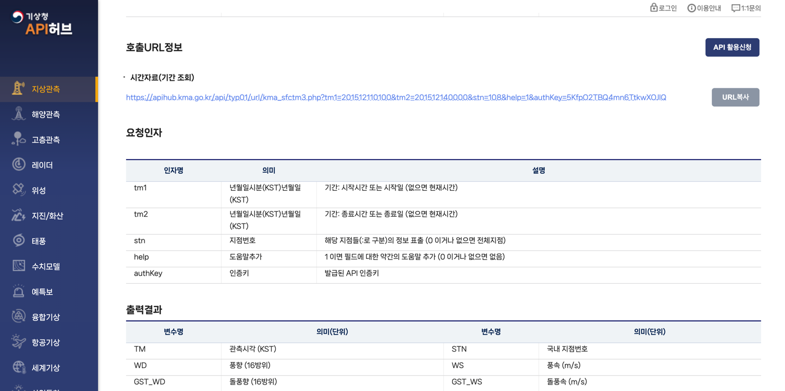

# 기상데이터 수집 가이드

> 기상청(KMA)의 날씨 데이터를 가져와 저장하는 작업을 자동화하는 스크립트를 제공합니다. 월별, 일별, 그리고 현재 월 데이터를 처리할 수 있는 기능을 제공합니다.

## 1. 수집 DOCS
- https://apihub.kma.go.kr/

## 2. `.env` 파일에 KMA API 키를 설정:
```plaintext
KMA_API_KEY=your_api_key_here
```

## 3. 활용 API
### 기간조회 API 


## 4. API KEY 세팅

- 위 기상청 사이트 접속 후 URL 뒤에 붙어있는 `authkey`를 복사하여, 프로젝트 `.env` 파일에 `KMA_API_KEY`로 세팅합니다.


## 5. 커맨드

### 1. 월별 데이터 가져오기 (`run_data_prepare_month_range`)

`run_data_prepare_month_range` 명령어는 특정 시작 연도와 월을 기반으로 월별 데이터를 가져옵니다.

#### 사용 예시

```bash
python weather_client.py run_data_prepare_month_range --start_year=2023 --start_month=1
```

#### 설명
- `--start_year` : 시작 연도 (예: 2023)
- `--start_month` : 시작 월 (예: 1)
- `--month_range_count` (옵션) : 가져올 개월 수. 기본값은 -1로, 전체 데이터를 가져옵니다.
  
### 2. 오늘의 날씨 데이터 가져오기 (`run_data_prepare_today`)

`run_data_prepare_today` 명령어는 오늘의 날씨 데이터를 가져옵니다.

#### 사용 예시

```bash
python weather_client.py run_data_prepare_today
```

#### 설명
- 오늘의 날짜에 해당하는 날씨 데이터를 가져옵니다.
- 결과는 `weather_daily.csv` 파일로 저장됩니다.

### 3. 현재 월의 날씨 데이터 가져오기 (`run_data_prepare_current_month`)

`run_data_prepare_current_month` 명령어는 현재 월의 날씨 데이터를 가져옵니다.

#### 사용 예시

```bash
python weather_client.py run_data_prepare_current_month
```

#### 설명
- 현재 연도와 월에 해당하는 월별 데이터를 가져옵니다.
- 결과는 `weather_monthly.csv` 파일로 저장됩니다.

## 추가 설명

- 모든 명령어는 데이터를 처리하고, 지정된 경로에 결과를 CSV 형식으로 저장합니다.
- 저장 경로는 기본적으로 `root_data_dir`에 설정되어 있으며, 필요에 따라 `--output_path` 옵션을 통해 변경할 수 있습니다.
